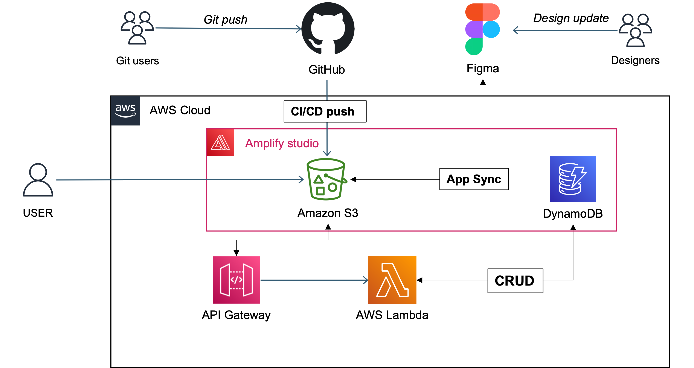

# amplify_training_mjs

## ゴール
- Amplify から DynamoDBにCRUDとして APIを呼び出しCRUDアプリとして使用できるところまで

## lambdaを使用したCRUD API

- DynamoDBを使用し、lambdaから作成、更新、削除を実行する
- API Gatewayを開始、POSTMANなどでリクエストができること
- Amplify studio から APIにリクエストをし結果を描画させることができること

## DynamoDBは共通して利用するため下記をテーブル名とする

- `http-crud-training-****` の ****をそれぞれ名称を決める。

## 構成

 

